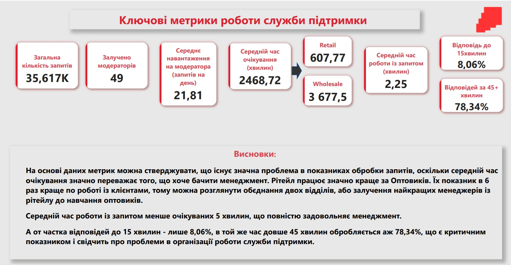
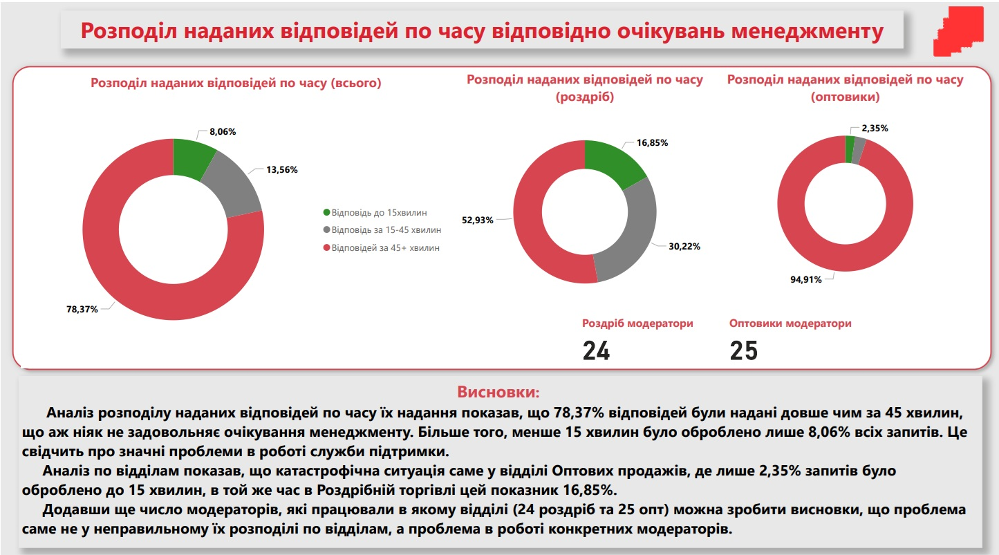
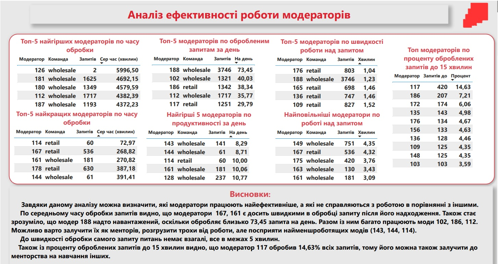
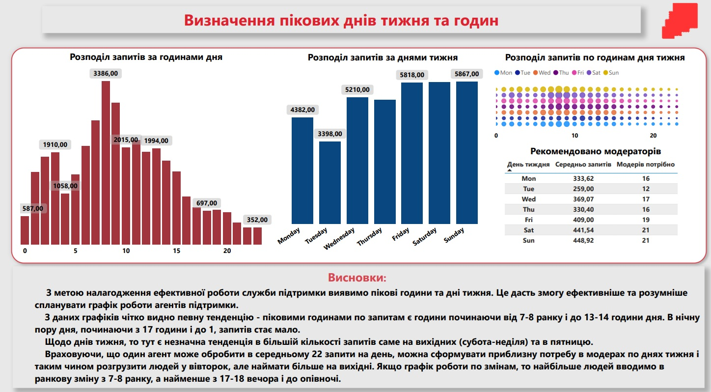

# 📊 Аналіз роботи служби підтримки

---

### 🧠 Опис проєкту

Даний проект - був тестовим завданням для SKELAR Analytics Intensive.
Тому я вирішив його опублікувати та додати до свого портфоліо проектів, так як досить багато часу та зусиль було витрачено на це.

Цей проєкт — аналітичне дослідження ефективності служби підтримки онлайн-маркетплейсу, який включає два сервіси: платформу для роздрібного продажу та платформу для гуртового продажу. Проєкт реалізовано в межах діяльності відділу *Operational Excellence*, відповідального за покращення внутрішніх процесів.

Після численних скарг клієнтів на затримки з відповідями та низьку якість обслуговування, менеджмент поставив завдання провести глибокий аналіз роботи служби підтримки, виявити слабкі місця та надати обґрунтовані рекомендації для підвищення рівня сервісу.

---

### 🎯 Мета проєкту

Метою проєкту є:

- **Оцінити відповідність роботи служби підтримки очікуванням менеджменту**, зокрема щодо:
    - середнього часу відповіді на звернення (очікуване значення — не більше 15 хвилин);
    - допустимого часу відповіді (максимум — 45 хвилин);
    - продуктивності агентів (до 5 хвилин на одне завдання після взяття в роботу).
- **Виявити слабкі місця** в розподілі навантаження між командами та протягом доби.
- **Проаналізувати ефективність кожного агента** з метою визначення найкращих практик або потреби в навчанні.
- **Надати рекомендації**, чи потрібно:
    - збільшувати чисельність команди підтримки;
    - змінювати графік роботи;
    - об'єднувати команди підтримки двох платформ для ефективнішого розподілу навантаження.

---

## 🗂️ Дата-профайлінг

Нижче наведено опис полів, які містяться у вихідному датасеті для аналізу ефективності роботи служби підтримки:

| Колонка | Опис |
| --- | --- |
| `id_request` | Унікальний ідентифікатор запиту користувача до служби підтримки. |
| `moderator` | Унікальний ідентифікатор агента підтримки, який обробляв запит. |
| `team` | Команда, до якої належить агент: `retail` (роздріб) або `wholesale` (гурт). |
| `request_time` | Час надходження запиту від користувача. |
| `start_time` | Час, коли агент розпочав обробку запиту. |
| `finish_time` | Час завершення обробки запиту. |

---

## 📊 Ключові метрики роботи служби підтримки (КПІ)

У цьому розділі представлені основні метрики, що дозволяють оцінити ефективність служби підтримки, відповідність очікуванням менеджменту та потенційні зони для покращення.

### 1. ⏱️ Середній час відповіді (Average Response Time)

**Опис:**

Показує середній час від моменту надходження запиту (`request_time`) до початку його обробки (`start_time`). Ця метрика важлива для оцінки швидкості реагування на нові запити.

**SQL-запит:**

```sql
SELECT
    ROUND(AVG(EXTRACT(EPOCH FROM start_time - request_time)) / 60, 2) AS avg_response_time_min
FROM support_requests;

```

---

### 2. 🕒 Середній час обробки запиту (Average Handling Time)

**Опис:**

Визначає, скільки часу в середньому витрачає агент на обробку запиту — від моменту початку до завершення (`finish_time - start_time`). В ідеалі — не більше 5 хвилин.

**SQL-запит:**

```sql
SELECT
    ROUND(AVG(EXTRACT(EPOCH FROM finish_time - start_time)) / 60, 2) AS avg_handling_time_min
FROM support_requests;

```

---

### 3. 📈 Відсоток SLA-виконання (SLA ≤ 15 хв)

**Опис:**

SLA (Service Level Agreement) — це очікування менеджменту, що відповідь на запит буде надана протягом 15 хвилин. Ця метрика показує, який відсоток запитів обробляється в межах цього часу.

**SQL-запит:**

```sql
SELECT
    ROUND(100.0 * COUNT(*) FILTER (
        WHERE EXTRACT(EPOCH FROM start_time - request_time) <= 900
    ) / COUNT(*), 2) AS sla_15_response_rate
FROM support_requests;

```

---

### 4. 🚨 Відсоток запитів із надто довгою відповіддю (> 45 хв)

**Опис:**

Ця метрика показує, скільки запитів очікували відповіді більше 45 хвилин — що вважається критичним порушенням очікувань.

**SQL-запит:**

```sql
SELECT
    ROUND(100.0 * COUNT(*) FILTER (
        WHERE EXTRACT(EPOCH FROM start_time - request_time) > 2700
    ) / COUNT(*), 2) AS long_response_rate
FROM support_requests;

```

---

### 5. 💼 Продуктивність агента (Avg. handled requests per agent)

**Опис:**

Середня кількість оброблених запитів на одного агента за весь період.

**SQL-запит:**

```sql
SELECT
    ROUND(AVG(requests_per_agent), 2) AS avg_requests_per_agent
FROM (
    SELECT
        moderator,
        COUNT(*) AS requests_per_agent
    FROM support_requests
    GROUP BY moderator
) sub;

```

---

### 6. 🔥 Загальна кількість запитів, що не вкладаються в “якісні” межі

**Опис:**

Підсумковий контроль якості — кількість запитів, які або чекали на відповідь більше 45 хвилин, або оброблялись довше 5 хвилин.

**SQL-запит:**

```sql
SELECT COUNT(*) AS low_quality_cases
FROM support_requests
WHERE
    EXTRACT(EPOCH FROM start_time - request_time) > 2700
    OR EXTRACT(EPOCH FROM finish_time - start_time) > 300;

```

---

### 📌 Висновки:

- **Середній час відповіді** дозволяє оцінити відповідність очікуванням SLA у 15 хвилин. Якщо метрика перевищує цей поріг — є проблема з пріоритезацією запитів.
- **Середній час обробки** має бути ≤ 5 хвилин. Перевищення — сигнал про перенавантаження агента або складність кейсів.
- **SLA-виконання** — ключова метрика, яку слід відстежувати щодня. Все, що нижче 90% — привід для втручання.
- **Запити з довгою відповіддю** повинні бути мінімізовані, інакше це впливає на NPS та довіру користувачів.
- **Продуктивність агентів** допомагає ідентифікувати як топ-виконавців, так і тих, хто відстає.
- **Кількість “низькоякісних” запитів** є загальним індикатором здоров’я системи підтримки.

---

## 📊 Ключові метрики роботи служби підтримки (КПІ)



### 1. Загальна кількість запитів - **35617**

---

### 2. Залучено модераторів - **49**

---

### 3. Середнє навантаження на модератора (запитів на день) - **21,81**

**SQL-запит:**

```sql
WITH daily_requests_per_agent AS (
    SELECT
        moderator,
        DATE(request_time) AS day,
        COUNT(*) AS requests_per_day
    FROM events
    GROUP BY moderator, DATE(request_time)
)
SELECT
    ROUND(AVG(requests_per_day), 1) AS avg_requests_per_agent_per_day
FROM daily_requests_per_agent;

```

---

### 4. Середній час очікування відповіді - **2468,72 хвилини**

### По командах:

- **Retail:** 607,8 хв (10 годин)
- **Wholesale:** 3677,5 хв (61 година)

**SQL-запит:**

```sql
SELECT
    team,
    ROUND(AVG(EXTRACT(EPOCH FROM start_time - request_time) / 60), 1) AS avg_response_time_minutes
FROM events
WHERE start_time IS NOT NULL
  AND request_time IS NOT NULL
  AND start_time >= request_time
GROUP BY team
ORDER BY avg_response_time_minutes;

```

---

### 5. Середній час роботи із запитом - **2,25 хвилини**

**SQL-запит:**

```sql
SELECT
    ROUND(AVG(EXTRACT(EPOCH FROM finish_time - start_time) / 60), 2) AS avg_handling_time_minutes
FROM events
WHERE finish_time IS NOT NULL
  AND start_time IS NOT NULL
  AND finish_time >= start_time;

```

---

### 6. Відповідей до 15 хвилин (очікування менеджменту) - **8,06%**

### 7. Відповідей за 45+ хвилин - **78,34%**

**SQL-запит:**

```sql
SELECT
    sla_category,
    COUNT(*) AS count_requests,
    ROUND(100.0 * COUNT(*) / SUM(COUNT(*)) OVER (), 2) AS percent
FROM (
    SELECT
        CASE
            WHEN EXTRACT(EPOCH FROM (start_time - request_time)) / 60 <= 15 THEN 'до 15 хв (відповідає очікуванням)'
            WHEN EXTRACT(EPOCH FROM (start_time - request_time)) / 60 <= 45 THEN '15–45 хв (ще допустимо)'
            ELSE 'більше 45 хв (погано)'
        END AS sla_category
    FROM events
) AS sla_stats
GROUP BY sla_category;

```

---

### 📌 Висновок

На основі даних метрик можна стверджувати, що існує значна проблема в показниках обробки запитів, оскільки середній час очікування значно переважає того, що хоче бачити менеджмент. Рітейл працює значно краще за Оптовиків. Їх показник в 6 раз краще по роботі із клієнтами, тому можна розглянути об’єднання двох відділів, або залучення найкращих менеджерів із рітейлу до навчання оптовиків.

Середній час роботи із запитом менше очікуваних 5 хвилин, що повністю задовольняє менеджмент.

А от частка відповідей до 15 хвилин — лише 8,06%, в той же час довше 45 хвилин обробляється аж 78,34%, що є критичним показником і свідчить про проблеми в організації роботи служби підтримки.

---

## 📊 Графіки

### ![**1. Середній час очікування відповіді на запит в хвилинах**]
(Images/Avg_Time.jpg)

```sql
SELECT
    request_time::date AS request_date,
    COUNT(*) AS total_requests,
    ROUND(AVG(EXTRACT(EPOCH FROM (start_time - request_time)) / 60), 2) AS avg_wait_time_min,
    COUNT(DISTINCT moderator) AS unique_moderators
FROM events
WHERE start_time IS NOT NULL
  AND request_time IS NOT NULL
  AND start_time >= request_time
GROUP BY request_date
ORDER BY 1;

```

**Висновки:**

Даний графік показує нам тенденції в швидкості обробки запитів модераторами. Перше, що можна одразу помітити — є дні, що значно відрізняються із загальної тенденції. Хоча середній час обробки запитів по днях не є таким, як очікує менеджмент, проте є аномальний тиждень, що значно виділяється із графіку.

Тиждень із **21.10.2020 по 28.10.2020** є аномальним і вказує на потенційні технічні проблеми або перебої в роботі систем. Ймовірно, запити в цей період не відображались модераторам, що призвело до затримок. Цей період потребує детального аналізу.

---

### 

📊

```sql
SELECT
    sla_category,
    COUNT(*) AS count_requests,
    ROUND(100.0 * COUNT(*) / SUM(COUNT(*)) OVER (), 2) AS percent
FROM (
    SELECT
        CASE
            WHEN EXTRACT(EPOCH FROM (start_time - request_time)) / 60 <= 15 THEN 'до 15 хв (відповідає очікуванням)'
            WHEN EXTRACT(EPOCH FROM (start_time - request_time)) / 60 <= 45 THEN '15–45 хв (ще допустимо)'
            ELSE 'більше 45 хв (погано)'
        END AS sla_category
    FROM events
) AS sla_stats
GROUP BY sla_category;

```

**Висновки:**

78,34% відповідей були надані **пізніше ніж через 45 хвилин**, що зовсім не відповідає очікуванням менеджменту. Лише **8,06%** запитів обробляються протягом перших 15 хвилин.

По відділах видно:

- **Оптові продажі**: 2,35% вчасних відповідей
- **Роздрібна торгівля**: 16,85% вчасних відповідей

Враховуючи, що в обох відділах майже однакова кількість модераторів (24 vs 25), причина не в кількості, а в **продуктивності окремих працівників**.

---

### 

📈

### Середній час очікування по модератору

```sql
SELECT
    moderator,
    COUNT(*) AS total_requests,
    ROUND(AVG(EXTRACT(EPOCH FROM (start_time - request_time)) / 60), 2) AS avg_wait_time_min
FROM events
GROUP BY moderator
ORDER BY avg_wait_time_min DESC
LIMIT 10;

```

### Середнє навантаження на модератора

```sql
WITH per_day AS (
    SELECT
        moderator,
        DATE(request_time) AS day,
        COUNT(*) AS daily_requests
    FROM events
    GROUP BY moderator, DATE(request_time)
)
SELECT
    moderator,
    ROUND(AVG(daily_requests), 1) AS avg_requests_per_day
FROM per_day
GROUP BY moderator
ORDER BY avg_requests_per_day DESC;

```

### Рекомендована кількість агентів на день

```sql
WITH daily_requests AS (
    SELECT
        DATE(request_time) AS day,
        TO_CHAR(request_time, 'Day') AS weekday_name,
        COUNT(*) AS total_requests
    FROM events
    GROUP BY DATE(request_time), TO_CHAR(request_time, 'Day')
),
weekday_summary AS (
    SELECT
        TRIM(weekday_name) AS weekday,
        ROUND(AVG(total_requests), 2) AS avg_requests_per_day,
        CEIL(AVG(total_requests) / 22.0) AS recommended_moderators
    FROM daily_requests
    GROUP BY TRIM(weekday_name)
)
SELECT *
FROM weekday_summary
ORDER BY
  CASE
    WHEN weekday = 'Monday' THEN 1
    WHEN weekday = 'Tuesday' THEN 2
    WHEN weekday = 'Wednesday' THEN 3
    WHEN weekday = 'Thursday' THEN 4
    WHEN weekday = 'Friday' THEN 5
    WHEN weekday = 'Saturday' THEN 6
    WHEN weekday = 'Sunday' THEN 7
  END;

```

**Висновки:**

Аналіз дозволив визначити топ ефективних та найменш ефективних модераторів.

- Модератори **167, 161** — найшвидші за часом реакції.
- Модератор **188** — обробляє найбільше запитів (73,45 на день).
- Модератори **102, 186, 112** також мають високе навантаження.
- **117** — модератор, який обробив 14,63% всіх запитів вчасно. Його можна залучити до навчання інших.

Час обробки запиту після відповіді — **в межах 5 хвилин**, що відповідає очікуванням.

---

### 

📊

### Розподіл по годинах

```sql
SELECT
    EXTRACT(HOUR FROM request_time) AS hour_of_day,
    COUNT(*) AS total_requests
FROM events
GROUP BY hour_of_day
ORDER BY hour_of_day;

```

### Розподіл по днях тижня

```sql
SELECT
    TO_CHAR(request_time, 'Day') AS day_of_week,
    COUNT(*) AS total_requests
FROM events
GROUP BY day_of_week
ORDER BY MIN(DATE_PART('dow', request_time));

```

### Рекомендована кількість агентів на день

```sql
WITH daily_requests AS (
    SELECT
        DATE(request_time) AS day,
        TO_CHAR(request_time, 'Day') AS weekday_name,
        COUNT(*) AS total_requests
    FROM events
    GROUP BY DATE(request_time), TO_CHAR(request_time, 'Day')
),
weekday_summary AS (
    SELECT
        TRIM(weekday_name) AS weekday,
        ROUND(AVG(total_requests), 2) AS avg_requests_per_day,
        CEIL(AVG(total_requests) / 22.0) AS recommended_moderators
    FROM daily_requests
    GROUP BY TRIM(weekday_name)
)
SELECT *
FROM weekday_summary
ORDER BY
  CASE
    WHEN weekday = 'Monday' THEN 1
    WHEN weekday = 'Tuesday' THEN 2
    WHEN weekday = 'Wednesday' THEN 3
    WHEN weekday = 'Thursday' THEN 4
    WHEN weekday = 'Friday' THEN 5
    WHEN weekday = 'Saturday' THEN 6
    WHEN weekday = 'Sunday' THEN 7
  END;

```

**Висновки:**

Пікові години — з **07:00 до 14:00**, мінімальна кількість запитів — після 17:00.

Пікові дні — **п’ятниця, субота, неділя**.

Один агент обробляє ≈22 запити на день, тож кількість модераторів по днях треба варіювати. Найбільше — на вихідні та п’ятницю, найменше — у вівторок. Також слід формувати **графік змін з акцентом на ранок**, коли найбільше запитів.

---

## 📌 Висновки та рекомендації

### ✅ **Висновки**

### 1. **Проблеми зі швидкістю реагування**

- Лише **8,06%** запитів обробляються до 15 хвилин, що значно нижче очікувань менеджменту.
- **78,34%** запитів обробляються довше 45 хвилин — це критичний показник, який свідчить про неефективну організацію роботи.
- Хоча середній час безпосередньої обробки (від `start` до `finish`) — менше 5 хвилин, **основна проблема полягає в затримці старту обробки** (від `request` до `start`).

### 2. **Порівняння відділів: Retail vs Wholesale**

- **Retail-відділ працює у 6 разів ефективніше за Wholesale** — 16,85% запитів оброблено до 15 хвилин проти лише 2,35% в оптовому.
- Кількість модераторів у відділах приблизно однакова (**24 проти 25**), тому **проблема — не у розподілі персоналу, а в ефективності окремих агентів**.

### 3. **Індивідуальна ефективність модераторів**

- Виділено найпродуктивніших агентів: **167, 161, 117** — високий % оброблених до 15 хв і/або швидкий старт обробки.
- Модератор **188** обробляє найбільше запитів — **понад 73 в день**, що може свідчити про перенавантаження.
- Найменш активні: **143, 144, 114** — можливо потребують менторської підтримки або перегляду мотивації.

### 4. **Проблемні періоди в роботі**

- Тиждень з **21 по 28 жовтня 2020 року** виявлено як аномальний — значні затримки, ймовірно через технічні чи системні збої.
- **Потрібне розслідування причин** для запобігання подібним ситуаціям у майбутньому.

### 5. **Аналіз навантаження по годинах і днях**

- **Пікові години**: з **07:00 до 14:00**. Найменше запитів — з **17:00 до 01:00 ночі**.
- **Найбільш завантажені дні**: **п’ятниця, субота, неділя**.

---

### 🛠️ **Рекомендації щодо покращення роботи служби підтримки**

### 1. **Переглянути структуру відділів**

- Розглянути **об’єднання відділів** або часткову інтеграцію команд.
- Залучити ефективних агентів з Retail до **менторства/тренінгів для Wholesale**.

### 2. **Підсилити внутрішню аналітику**

- Регулярно **відслідковувати KPI по кожному агенту**: середній час старту, % оброблених до 15 хв, загальне навантаження.
- Виявляти та **розвантажувати перенавантажених модераторів**, як-от модератор 188.

### 3. **Оптимізувати розклад роботи**

- Перенести ресурси на **ранкові зміни**: збільшити кількість агентів з 07:00 до 14:00.
- Зменшити кількість **вечірніх змін**, де запитів значно менше.
- Забезпечити **посилену присутність у п’ятницю, суботу та неділю**.

### 4. **Впровадити навчання та коучинг**

- Визначити **топ агентів як наставників** — 117, 161, 167.
- Для агентів із низькою ефективністю організувати **індивідуальні плани розвитку**.

### 5. **Технічна перевірка системи**

- Провести **технічний аудит** періоду **21–28 жовтня 2020 року** — перевірити логи, інциденти, відповіді системи.
- За потреби — **внести зміни до логіки розподілу запитів або UI системи**.

---

## 🛠️ Технології та інструменти

Для реалізації проєкту використано сучасні інструменти з обробки, зберігання, аналізу та візуалізації даних:

- **PostgreSQL** — зберігання, фільтрація, обробка великих обсягів даних
- **Power BI** — побудова інтерактивного аналітичного дашборду
- **Git + GitHub** — контроль версій і публікація результатів

---

## 📂 Файли

Опис основних файлів, які входять до структури проєкту:

- `README.md` — поточний звіт із описом проєкту
- `orders.csv` — файл з усіма даними
- `Dashboard.pbix` — Power BI дашборд з візуалізаціями та KPI
- `SQL-code.sql` — SQL-запити для роботи із набором даних
- `Presentation.pdf` — експортований звіт-дашборд у PDF-форматі
